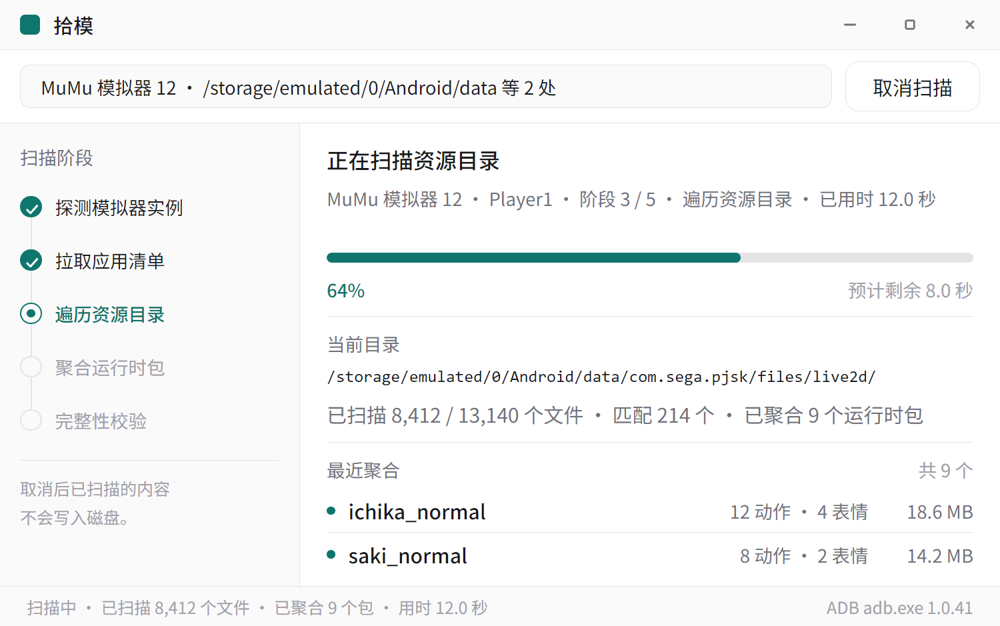
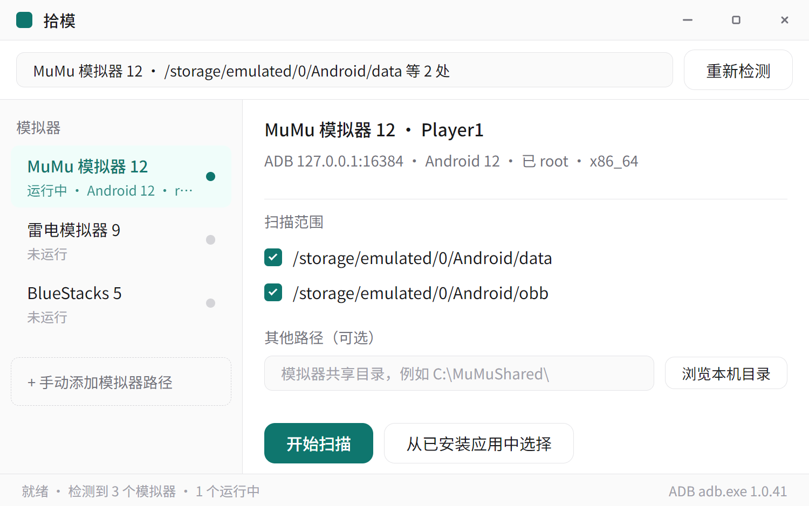
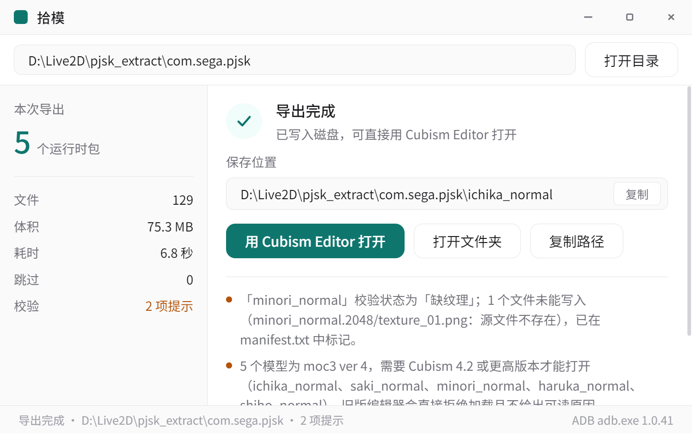
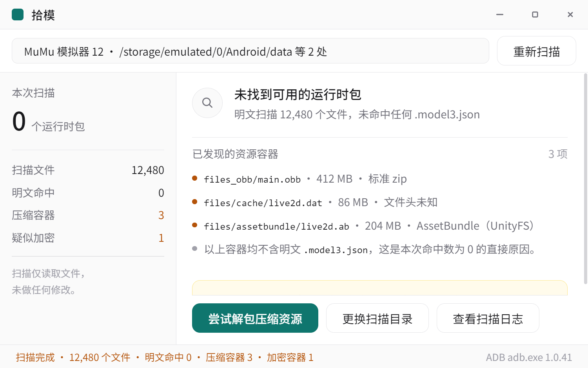
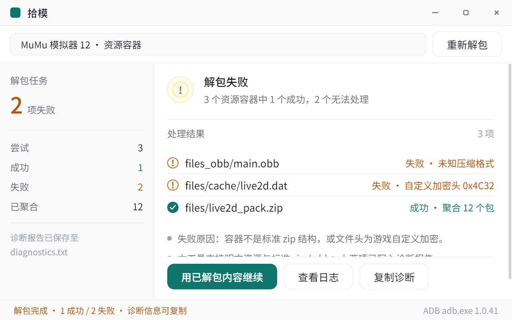

# 拾模

**Windows 桌面端 Live2D 运行时包提取工具。**

自动发现本机安卓模拟器实例，通过 ADB 扫描目标游戏目录，把散落的 Live2D 运行时文件
以 `.model3.json` 为锚点聚合成完整模型包，导出到本地磁盘后直接调用 Cubism Editor 打开。

> 解决的是「想改游戏里的 Live2D 模型，却要先学会扒包」这件事。
> 面向做二创 / 改模 / 拆解学习的人，不面向普通玩家。



## 功能概览

| 编号 | 功能 | 说明 |
|---|---|---|
| FR-01 | 模拟器实例发现与连接 | 自动列出本机模拟器实例（含多开），标注运行状态与 root 状态；未运行的实例给启动引导而非报错 |
| FR-02 | 扫描范围配置 | 默认覆盖 `/sdcard/Android/data`、`/sdcard/Android/obb`，支持自定义路径；等价路径去重，UTF-8 显式解码 |
| FR-03 | 资源扫描与进度反馈 | 显示整体百分比 **与当前正在遍历的目录路径 + 实时计数**；可取消，取消后不落盘 |
| FR-04 | 运行时包聚合 | 以 `.model3.json` 为锚点沿引用关系收拢 `.moc3` / 纹理图集 / motions / expressions / physics3；孤立 `.moc3` 不进列表 |
| FR-05 | 完整性校验 | 缺 moc3 / 缺纹理 / 无动作 / 无表情分档标注；`.moc3` 版本前移到导出前检测 |
| FR-06 | 结果列表与筛选 | 表格呈现，按完整性与来源分组筛选；底部「已选 N 个 · 合计体积」与勾选严格一致 |
| FR-07 | 导出与另存为 | 原样保持相对路径（路径基准是 `.model3.json` 所在目录），文件名不转码 |
| FR-08 | 一键调用 Cubism Editor | 导出完成页直接调起本机 Editor 打开所选模型 |
| FR-09 | 容器资源处理 | 识别 zip 等标准容器并尝试解包；识别不了的文件头如实说明原因，不静默跳过 |
| FR-10 | 异常与错误处理 | 覆盖扫描与导出全链路异常态，每个失败态都给出可执行的下一步 |

## 界面

设计稿：`design/shimo-desktop-live2d-design.html`（单文件内联 SVG，4 屏主流程 + 2 个异常态）

| 连接 | 扫描中 | 导出完成 |
|---|---|---|
|  |  |  |

异常态坚持「解释原因 + 给可执行的下一步」，不给静默空表：

| 扫描结果为空 | 解包失败 |
|---|---|
|  |  |

## 快速开始

### 直接用打包产物

双击 `dist/拾模-1.0.0-win-x64/拾模.exe`，整个文件夹可拷到任意 Windows 10/11 机器直接运行，无需安装。
日志在 `%APPDATA%\拾模\logs\`。

### 从源码运行

需要 Node.js 20+（本机实测 22.x）。

```bash
node tools/launch.js                              # 启动应用
node tools/launch.js --app tools/selfcheck        # 六屏界面自检 + 截图
node tools/launch.js --app tools/probe-emulator   # 模拟器发现链路诊断（打原始探测结果）
node tools/package.js --verify                    # 打包并真实启动一次产物
```

> 本机 `npm` 起不来（环境缺 `bash`），所有脚本一律直接用 `node` 调。
> 依赖只有 `electron` 一个，首次拉取仓库后需要装：`npm install`
> （`node_modules/` 与 `dist/` 都不进版本库）。

## 架构

```
src/
  main/
    index.js          应用入口：窗口（1200×750、自绘标题栏）、单实例锁
    ipc.js            34 个 IPC 通道，会话状态全部由主进程持有
    core/
      emulator-finder.js   实例发现（注册表 + 进程 + adb devices 三路交叉验证）
      adb.js               ADB 调用封装（字节流 + 显式 UTF-8 解码）
      scanner.js           目录遍历与模型包聚合
      container.js         容器文件头识别 + zip 索引读取 / 条目解压
      unpacker.js          容器处理编排：哪些能解、哪些不能、为什么
      packer.js            打包：按引用关系收拢文件
      validator.js         完整性校验 + `.moc3` 版本头解析
      exporter.js          落盘导出 + manifest.txt
      cubism.js            注册表定位 Cubism Editor 并调起
      path-utils.js        设备路径规则（显示名 / 来源包名 / 去重 / 相对路径）
      logger.js            写 `%APPDATA%\拾模\logs\`
  preload/index.js    contextBridge 暴露 `window.shimo.<分组>.<方法>`
  renderer/
    js/screens.js     六屏渲染
    js/app.js         状态机与事件分发
    styles/           设计系统 token + 样式
test/                 单测（node:test）
tools/
  launch.js           启动器（清掉 ELECTRON_RUN_AS_NODE）
  verify.js           静态校验：语法 + preload↔渲染层接口核对 + 模块导出核对
  selfcheck/          六屏真实渲染截图 + 几何/不变量断言
  probe-emulator/     发现链路诊断
  package.js          打包
```

技术栈：**Electron 33 + 原生 JS**，无框架、无打包器、无构建步骤。
选它是因为本机 npm 装不了打包工具链，而 Electron 打包本质只有三件事：
复制运行时 → 放 `resources/app/` → 改 exe 名，node 内置 `fs` 就够。

## 开发约定

### 校验三件套 —— 改完必跑

```bash
node tools/verify.js                        # 语法 + 接口/导出核对
node --test test/*.test.js                  # 单测
node tools/launch.js --app tools/selfcheck  # 六屏真实渲染 + 几何检查
```

### 三条硬约定

1. **同一规则不得在多处各写一份。**
   已栽过两次：容器显示名（扫描页用 basename、解包页另一套，同一容器在相邻两屏名字不同）、
   来源包名正则（scanner 与 unpacker 各一份）。现已收进 `core/path-utils.js`
   （`deviceDisplayName` / `sourcePackageOf`）。新增跨模块规则先想想该不该放这里。

   **容器显示名 = 去掉 `/Android/data|obb/<包名>/` 前缀后的相对路径**。
   不是末两段 —— 那个猜法解释不了设计稿的 `files/cache/live2d.dat`。

2. **自检 fixture 里的展示值必须由真实函数算出来，不能手写。**
   fixture 一旦和规则漂开，截图就会显示运行时永不出现的名字 —— **截图为实现打掩护**。
   `test/fixtures.test.js` 负责拦。

3. **允许滚动，但溢出量锁基线。**
   屏 4 / 态 A / 态 B 装不下是已知且接受的（主区高度由用户数据决定）。
   溢出一旦涨上去就是版式回归：基线在 `tools/selfcheck/layout-baseline.js`，超限 → 自检退出码 1。
   新增屏幕要在 `tools/selfcheck/screens.js` 登记 + 补基线，否则自检会静默跳过它。

4. **自检截图必须字节可重现，否则它就不能进版本库。**
   `output/selfcheck/*.png` 是 README 直接引用的（不另存副本 —— 副本会漂，就是约定 1 那个坑），
   所以它们必须在仓库里。代价是每次重跑自检都会产生 diff：
   只要 diff 是**噪**的，真发生 UI 变化时反而看不出来。抖动的来源是次像素抗锯齿（LCD text），
   它依赖 GPU 与屏幕子像素排列。`tools/selfcheck/main.js` 里两个开关钉死它：

   ```js
   app.commandLine.appendSwitch('disable-lcd-text');
   app.commandLine.appendSwitch('force-color-profile', 'srgb');
   ```

   实测连跑两次，7 张 PNG **字节完全一致**（sha256 全等）。加渲染开关前是 5/6 每次变。

### 实例身份一律用 `id`，绝不用 `serial`

未运行的实例 `serial` 是 `null`（它压根没连上 adb），而 `null === null` 为真 ——
用 serial 认实例会让**所有未运行实例互相相等**：自动选择被击穿、界面把未运行的实例
渲染成选中项、侧栏一起高亮。

规则收在 `emulator-finder.js` 的 `instanceKey` / `findInstance` / `selectDefaultInstance`。
默认只选 `running && state === 'device'` 的实例，**宁可不选也不选一个连不上的**。

## 打包

```bash
node tools/package.js            # 复制运行时 + 放 resources/app + 改 exe 名为「拾模.exe」
node tools/package.js --verify   # 额外真启动一次产物，确认 window ready
```

产物 `dist/拾模-<版本>-win-x64/`，约 268 MB。
**`--verify` 是必须的**：静态检查只能证明文件都在，证明不了它跑得起来。

## 发布

```bash
node tools/package.js --verify    # 1. 打包并真启动一次产物
node tools/archive.js             # 2. 压成 zip（默认解压回来逐文件比对）
node tools/release.js --dry-run   # 3. 检查前置条件
node tools/release.js             # 4. 建 draft → 上传 → 转正式发布
```

发布说明写在 `docs/releases/v<版本>.md`，脚本直接拿它当 release 正文。
改了说明要同步线上：`node tools/release.js --notes-only`。

**asset 名必须是 ASCII。** GitHub 会**静默剥掉** release asset 名里的非 ASCII 字符 ——
`拾模-1.0.0-win-x64.zip` 传上去会变成 `-1.0.0-win-x64.zip`，不报任何错。
所以 `package.json` 里有 `assetBaseName: "ShiMo"`，zip 与 asset 名都用它拼；
zip **内部**的顶层目录仍是中文 `拾模-1.0.0-win-x64/`，用户解压后看到的是中文目录和 `拾模.exe`。

`tools/archive.js` 是手写的 ZIP 容器（node 内置 zlib + `zlib.crc32`）。
**默认会用 `tar` 解压一遍再逐文件比 md5** —— 自己读自己写的 zip 是自证，
交给 libarchive 这个独立实现才算数。跳过用 `--no-verify`，但发布前别跳。

> 凭据：`release.js` 从 git 凭据助手现取 token，**不落盘、不打印、不进命令行** ——
> 传给 curl 走 `-K` 配置文件，用完即删。系统级 `credential.helper=helper-selector`
> 是交互式的会挂住，所以显式用 `wincred` 读 Windows 凭据管理器。

## 已知限制

- **游戏资源常打包进 AssetBundle / `.obb` / 加密容器**，明文扫描会扫不到。
  典型如碧蓝航线：资源在 `Android/data/com.bilibili.azurlane/files/AssetBundles/live2d/`，
  路径可访问但本体是 UnityFS（`.unity3d`），按 `.model3.json` 扩展名**一个都扫不到**；
  需 UABE / AssetStudio 解析 + 「Unity 动画 → `motion3.json`」格式转换。
  工具对此类资源**如实提示原因**，不静默返回空结果。
- **`.moc3` 无法反编译回 `.cmo3`**；`.moc3` 版本与 Cubism Editor 支持的 SDK 版本必须匹配。
- **模拟器实例必须处于运行状态**才能扫描 —— 系统盘是 vmdk/img 镜像，本工具不解析镜像，统一走 ADB。
- 图标为 Electron 默认图标（换图标要给 exe 改 Windows 资源，需 rcedit）。
- 未做代码签名，Windows 可能提示「未知发布者」。

## 文档

- 产品需求文档：[docs/拾模-产品需求文档.md](docs/拾模-产品需求文档.md) ·
  [docs/拾模-产品需求文档.docx](docs/拾模-产品需求文档.docx)
- 界面设计稿：[design/shimo-desktop-live2d-design.html](design/shimo-desktop-live2d-design.html)

## 许可

未指定。
